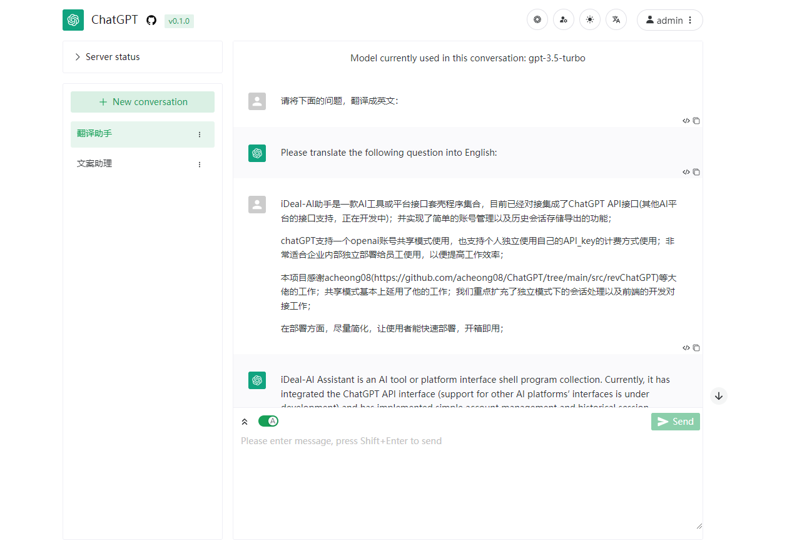

<h1 align="center"> iDealAIHelper</h1>

<div align="center">

<hr/>

[English](README.md) / 简体中文

One-Click to deploy well-designed ChatGPT web UI tool program.

一键免费部署你的 ChatGPT 网页应用。

[Demo]() / [Issues](https://github.com/ncepu-iDealStudio/iDealAIHelper/issues) / [Join Discord](https://discord.gg/) / [Buy Me a Coffee](https://www.buymeacoffee.com/iDealStudio)

[演示]() / [反馈](https://github.com/ncepu-iDealStudio/iDealAIHelper/issues) / [QQ 群]() / [打赏开发者](.github/images/support.png)




</div>

### 介绍
<hr/>

iDealAI助手是一款封装了各类AI工具接口的套壳Web系统；目前已经对接集成了ChatGPT API接口(其他AI平台的接口支持，正在开发中)；

主要作用是可以以接口账号合租的方式使用AI工具；不仅适合个人与他人合租ChatGPT账号使用，也适合国内企业独立部署给员工使用，解决国内无法访问openai的接口的问题；

系统使用chatGPT的方式有2种：

1 共享模式

 支持一个openai账号共享给大家一起使用；但每个人有独立的系统登录账号，会话能单独分开存储；

2 独立模式

 支持个人独立使用自己的API_key来使用；并实现了相应的账户管理以及历史会话存储、导出的功能；


本项目后端部分感谢acheong08等大佬的工作；共享会话模式基本上延用了他的工作；我们重点扩充了独立模式下的会话处理以及前端的开发对接工作；

前端部分，感谢moeakwak的工作；在他的UI界面基础上，我们结合个人或企业内部员工使用的场景，在功能上做了更多的扩展和延伸；

在部署方面，做到尽量简化，让使用者能快速部署，开箱即用；

### 软件架构
<hr/>

本系统分为前端部分和后端接口部分：

1 前端采用Vue3+TypeScript+Vite+naive-ui等技术；

2 后端采用Python+FastAPI框架；为简化部署，数据库采用SQLlite存储，也能扩展成MySQL；

这两部分都能实现容器化快速部署；

### 安装使用
<hr/>

#### Docker方式部署

1. 确保在服务器上安装了docker以及docker-compose软件；
2. 下载本项目：
`git clone https://gitee.com/ncepu-bj/iDeal-AI-Helper.git` ，
 进入项目文件夹：
 `cd iDeal-AI-Helper`
3. 查看系统配置文件：`deploy/config.conf`，开启共享模式需要配置`chatgpt_access_token`参数。注：chatgpt_access_token获取方法：打开登录[chat.openai.com]()后，打开[https://chat.openai.com/api/auth/session]()，获取accessToken字段，复制到配置文件中；
4. 在项目根目录下运行：`docker-compose up -d`命令，如果出错请查看docker-compose版本，版本过低则需要升级。容器端口在docker-compose.yaml文件中有所定义，默认映射为8080端口，可以根据需求进行修改；
5. 访问`http://[your server ip]:8080`，可以看到登录界面(输入默认账号/密码:admin/admin)，如果可以正常登录，则部署完成。

#### 手工方式部署

##### 前端页面打包编译：

1. 进入前端文件夹frontend中；如果已经有编译好的静态页面文件夹"dist"，则直接进入"后端部署部分";否则，进入下一步进行前端页面的打包编译；
2. 运行`npm install`以及`npm run build`，打包编译生成前端静态页，在`frontend/dist`中；

##### 后端部署：
1. 创建Python虚拟环境(推荐版本V3.10)并激活；
2. 进入backend文件夹，安装系统依赖包，运行：`pip install -r requirements.txt`；
3. 在backend文件夹中，运行：`uvicorn main:app --host 0.0.0.0 --port 8000 --proxy-headers --forwarded-allow-ips '*' --log-config config/logging_config.yaml`；
4. 将目录 `frontend/dist/`作为Web的发布目录；可以通过nginx对前端与后端服务进行配置，可以参考以下配置：

```
server {
	listen 80;
	server_name [your server name];

    # 前端
    location / {
        root [your project abspath]/frontend/dist;
        try_files $uri $uri/ /index.html;
    }
    # 接口
    location /api/ {
        proxy_pass http://127.0.0.1:8000/;
        proxy_set_header Host $host;
        proxy_set_header X-Real-IP $remote_addr;
        proxy_set_header X-Forwarded-For $proxy_add_x_forwarded_for;
        proxy_http_version 1.1;
        proxy_set_header Upgrade $http_upgrade;
        proxy_set_header Connection "upgrade";
    }
}
```
5. 启动Web服务器Nginx后，访问`http://[your server ip]`，可以看到登录界面(输入默认账号/密码:admin/admin)，如果可以正常登录，则部署完成。

### 系统特点
<hr/>

功能丰富的前端交互操作
1. 美观简洁的 web 界面，使用 naive-ui
2. 适配夜间模式
3. 支持一键复制回复内容或代码内容
4. 支持显示回复中的图像/表格/数学公式/代码语法高亮
5. 一键导出对话为Markdown文件
6. 动态显示回复内容
7. 支持停止生成对话

多用户共享管理
1. 共享一个 ChatGPT 账号，支持创建管理多用户账号；
2. 不同用户创建的 ChatGPT 对话互相分隔，不会相互影响；
3. 多用户同时请求时，会进行排队处理；

完善的管理功能
1. 管理员可设置用户的最大对话数量、对话次数限制等
2. 提供实时更新的服务使用状态，从而能够避开使用高峰
3. 修改用户对话限制
4. 管理对话/查看成员对话记录/分配对话给特定用户
5. 实时查看日志
6. 记录请求及对话统计信息

### 使用说明
<hr/>

部署完成后，通过ip地址和端口访问；系统默认已经添加了2个用户；
先使用管理员账号（admin/admin）登录；然后进行用户的创建；

详细使用说明，见帮助文档；

### 参与贡献
<hr/>

1.  Fork 本仓库
2.  新建 Feat_xxx 分支
3.  提交代码
4.  新建 Pull Request


### 捐助和支持
<hr/>

如果您觉得这个项目对您的工作有帮助了✨，可以通过扫描下面的赞赏码进行捐助，鼓励我们将工作做的更好！
<div align="center">

<p>~支付宝支持我们的项目👆~</p>
</div>